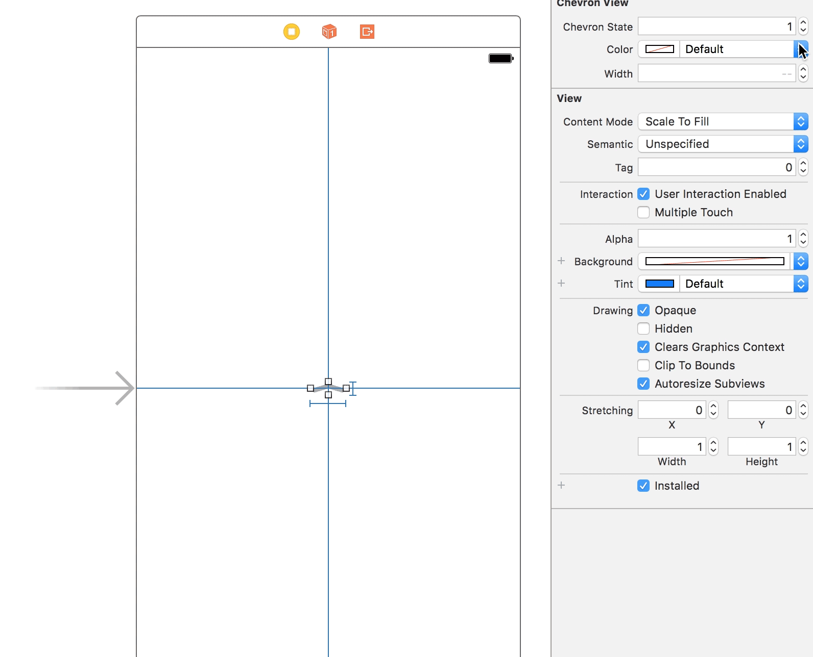

# LNChevronView


Customizable chevron view reimplementation of Apple's, as seen in Springboard / Apple Music. Can be customized directly from Xcode.

## Adding to Your Project

### Carthage

Add the following to your Cartfile:

```github "LeoNatan/LNChevronView"```

### Manual

Drag `LNChevronView.h` and `LNChevronView.m` to your project.

## Using

Import the header file:

```#import "LNChevronView.h"```

For Swift projects, add the above import statement to your bridging header file.

You can control all properties of the chevron view from Interface Builder:



Chevron state is controlled using the `state` property. To set the state with animation, use `setState:animated:`/`setState(_,animated:)`.
Other properties of interest include `color`, `width` and `animationDuration`. 
